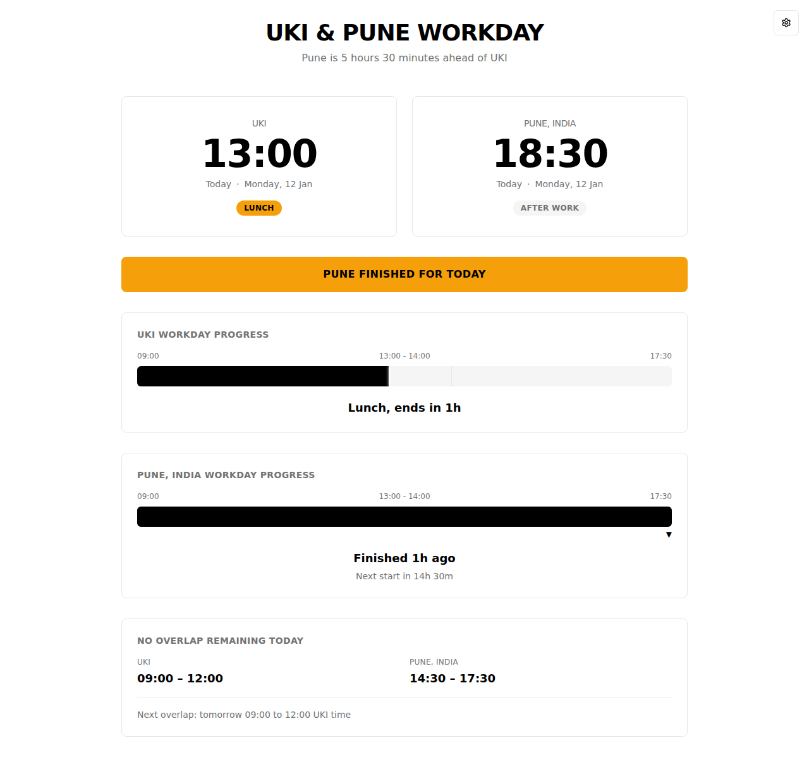
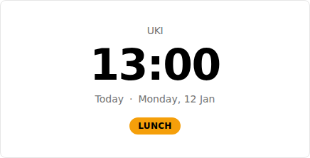
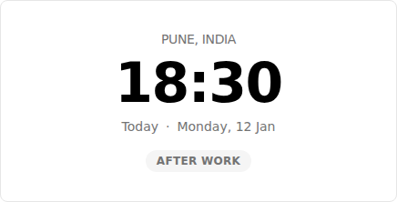
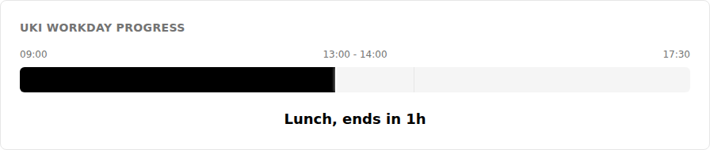
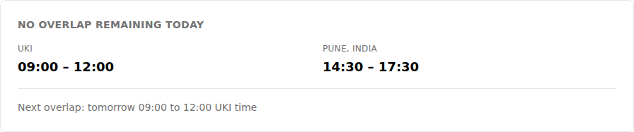
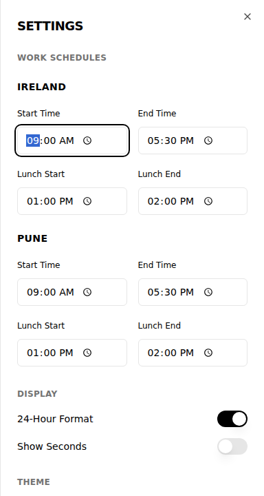

# Application Screenshots

This directory contains screenshots demonstrating the application's functionality and UI components.

## Full Application View

**Full Page Screenshot:**


## Component Screenshots

### Time Cards
Display current time and work status for each location:

**UKI Time Card:**


**Pune Time Card:**


### Status Indicators

**Message Indicator:**


### Progress Tracking

**UKI Workday Progress:**


### Overlap Information

**Overlap Indicator:**


### Settings Panel

**Settings Dialog:**


---

## How to Update Screenshots

When making UI changes, update screenshots using Playwright:

```bash
# Start the preview server
npm run build
npm run preview

# Use Playwright to capture screenshots
# See .github/copilot-instructions.md for detailed examples
```

### Full Page Screenshot
```typescript
await page.screenshot({ 
  fullPage: true, 
  path: 'screenshots/full-page-app.png' 
});
```

### Component Screenshot
```typescript
await page.locator('selector').screenshot({
  path: 'screenshots/component-name.png'
});
```

---

**Last Updated:** January 12, 2026
